# Unikraft EuroSys'21 Artifacts

This repository contains the artifacts, including experiments and graphs, for
the paper: "Unikraft: Fast, Specialized Unikernels the Easy Way".

 > **Abstract**:  Unikernels are famous for providing excellent performance in
 > terms of boot times, throughput and memory consumption, to name a few
 > metrics.  However, they are infamous for making it hard and extremely time
 > consuming to extract such performance, and for needing significant
 > engineering effort in order to port applications to them.  We introduce
 > [Unikraft](http://unikraft.org), a novel micro-library OS that (1) fully
 > modularizes OS primitives so that it is easy to customize the unikernel and
 > include only relevant components and (2) exposes a set of composable,
 > performance-oriented APIs in order to make it easy for developers to obtain
 > high performance.
 >
 > Our evaluation using off-the-shelf popular applications such as NGINX,
 > SQLite, and Redis shows that running such applications on Unikraft results
 > in a 1.7x-2.7x performance improvement compared to Linux guests.  In addition,
 > Unikraft images for these apps are around 1MB, require less than 10MB of RAM
 > to run, and boot in around 1ms on top of the VMM time (total boot time
 > 2ms-70ms).

[Unikraft](http://unikraft.org) is a Linux Foundation open source project and
Xen Incubator Project.  Most of the code used for this paper is upstream, or is
in the process of being upstreamed.

## Contents of this Document

  1. [Experiments](#1-experiments): List of all experiments in the paper. 
  2. [Repository structure](#2-repository-structure): Details the organization
     of this repository.
  3. [Prerequisites](#3-prerequisites): Explains how host machines were set up
     for the experiments.  
      3.1. [Hardware](#31-hardware): Details of hardware setup in the paper and
           general recommendations.  
      3.2. [Kernel](#32-kernel): Details on kernel requirements for the
           experiments which must be addressed manually.
  4. [Getting Started](#4-getting-started): Information on how to use this
     repository to fully recreate the experiments.  
     4.1. [`run.sh` Usage](#41-runsh-usage): Provides the help page for the
          `run.sh` wrapper program.
  5. [Notes](#5-notes): Additional notes.
  6. [Beyond the Paper](#6-beyond-the-paper): Run Unikraft in production!

## 1. Experiments

The paper comes with 22 figures, 4 tables and 2 in-line text worth of
experiments (although not all of them have experimental results, e.g., Figure 4
is an architecture diagram). Each experiment and the relevant scripts to
generate the data and subsequent plots are included in this repository.  We
expect the results generated from this artifact to match one-to-one with the
results in the paper, given that we used this artifact/scripts to actually
generate all figures in the paper.

Each figure, table and corresponding experiment are listed below:

| Figure                                                     |                                                                      | Description                                                                                                                                                                                                                   | Est. runtime |
|------------------------------------------------------------|----------------------------------------------------------------------|-------------------------------------------------------------------------------------------------------------------------------------------------------------------------------------------------------------------------------|--------------|
| [`fig_01`](/experiments/fig_01_linux-deps/)                | 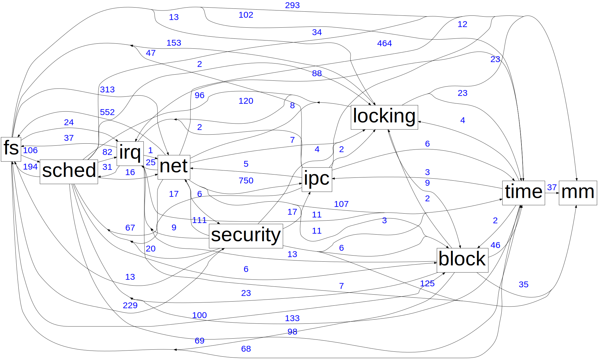                | Linux kernel dependency graph.                                                                                                                                                                                                | 0h 50m       |
| [`fig_02`](/experiments/fig_02_unikraft-nginx-deps/)       |        | NGINX Unikraft dependency graph.                                                                                                                                                                                              | 0h 5m        |
| [`fig_03`](/experiments/fig_03_unikraft-helloworld-deps/)  | 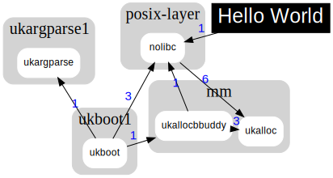  | "Hello World" Unikraft dependency graph.                                                                                                                                                                                      | 0h 1m        |
| [`fig_05`](/experiments/fig_05_syscall-heatmap/)           | 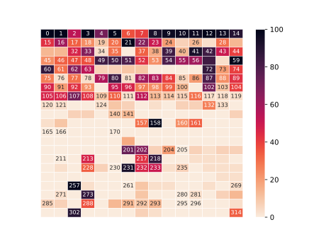           | Syscalls required by a set of [30 popular server applications](https://popcon.debian.org/) versus syscalls currently supported by Unikraft.                                                                                   | 0h 45m       |
| [`fig_07`](/experiments/fig_07_syscall-support/)           | 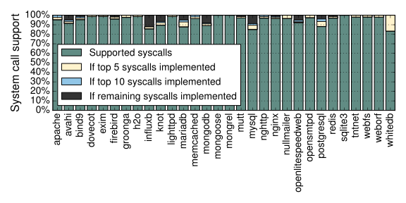           | Syscall support for [top 30 server apps](https://popcon.debian.org/). All apps are close to being supported, and several already work even if some syscalls are stubbed (SQLite, NGINX).                                      | 0h 45m       |
| [`fig_08`](/experiments/fig_08_unikraft-image-size/)       | 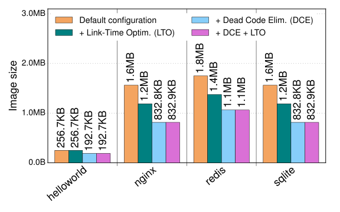       | Image sizes of Unikraft applications.  We include  permutations with and without LTO and DCE.                                                                                                                                 | 0h 1m        |
| [`fig_09`](/experiments/fig_09_compare-image-size/)        | 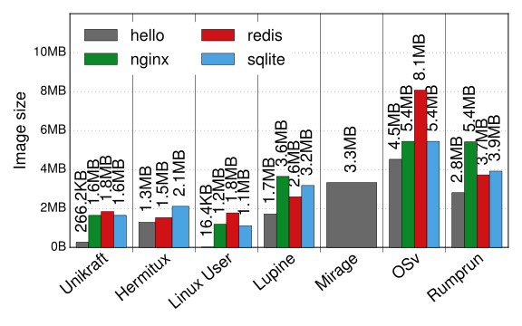        | Image sizes for representative applications with Unikraft and other OSes, stripped, without LTO and DCE.                                                                                                                      | 0h 5m        |
| [`fig_10`](/experiments/fig_10_unikraft-boot/)             | 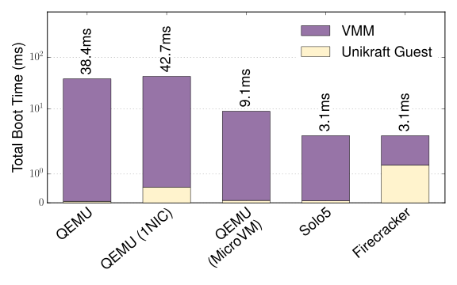             | Boot time for Unikraft images with different virtual machine monitors.                                                                                                                                                        | 0h 9m        |
| [`fig_11`](/experiments/fig_11_compare-min-mem/)           | 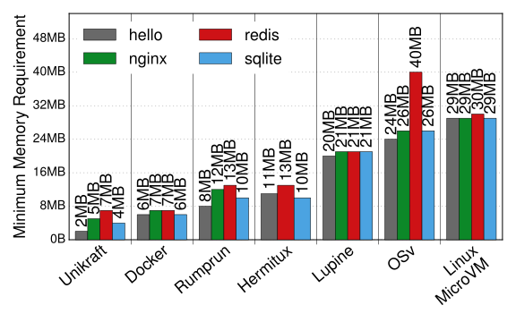           | Minimum memory needed to run different applications using different OSes, including Unikraft.                                                                                                                                 | 0h 50m       |
| [`fig_12`](/experiments/fig_12_redis-perf/)                |                 | Redis performance tested with the [`redis-benchmark`](https://github.com/redis/redis/blob/2.2/src/redis-benchmark.c), (30 connections, 100k requests, pipelining level of 16).                                                | 0h 9m        |
| [`fig_13`](/experiments/fig_13_nginx-perf/)                | 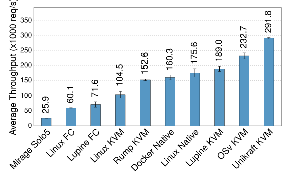                | NGINX (and Mirage HTTP-reply) performance tested with [`wrk`](https://github.com/wg/wrk) (1 minute, 14 threads, 30 conns, static 612B HTML page).                                                                             | 0h 50m       |
| [`fig_14`](/experiments/fig_14_unikraft-nginx-alloc-boot/) | 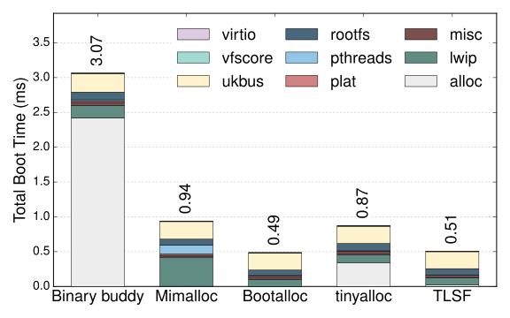 | Unikraft Boot time for NGINX with different memory allocators.                                                                                                                                                                | 0h 8m        |
| [`fig_15`](/experiments/fig_15_unikraft-nginx-throughput/) | 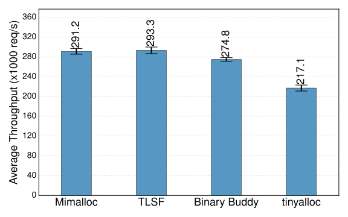 | NGINX throughput with different memory allocators.                                                                                                                                                                            | 0h 30m       |
| [`fig_16`](/experiments/fig_16_unikraft-sqlite-alloc/)     | 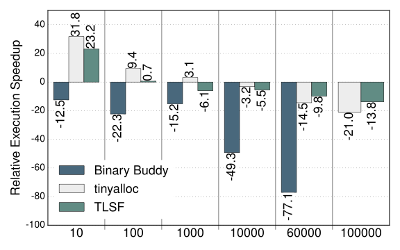     | Execution speedup in SQLite Unikraft, relative to [mimalloc](https://github.com/microsoft/mimalloc).                                                                                                                          | 0h 21m       |
| [`fig_17`](/experiments/fig_17_unikraft-sqlite-libc/)      | 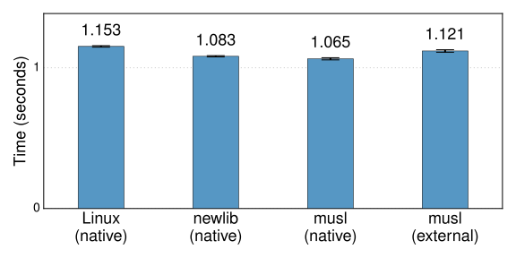      | Time for 60k SQLite insertions with native Linux, [newlib](https://sourceware.org/newlib/) and [musl](https://www.musl-libc.org/) on Unikraft (marked as native) and SQLite ported automatically to Unikraft (musl external). |              |
| [`fig_18`](/experiments/fig_18_unikraft-redis-alloc/)      | 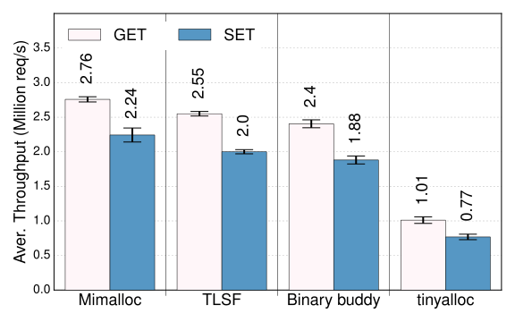      | Throughput for Redis Unikraft, with varying memory allocators and request type (`redis-benchmark`, 30 concurrent conns, 100k requests, and a pipelining level of 16.)                                                         | 0h 5m        |
| [`fig_19`](/experiments/fig_19_compare-dpdk/)              | 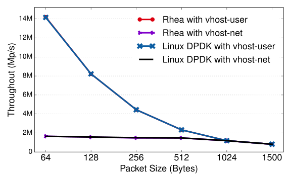              | TX throughput comparison of Unikraft versus [DPDK](https://www.dpdk.org/) in a Linux VM.                                                                                                                                      |              |
| [`fig_20`](/experiments/fig_20_compare-9pfs/)              | 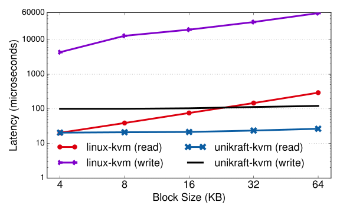              | [9pfs](https://xenbits.xen.org/docs/unstable/misc/9pfs.html) latency for read and write operations, compared to Linux.                                                                                                        | 2h 0m        |
| [`fig_21`](/experiments/fig_21_unikraft-boot-pages/)       | 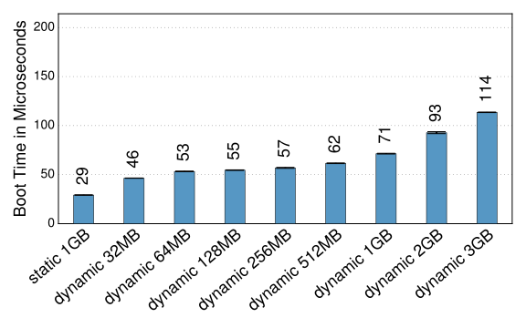       | Unikraft boot times with static and dynamic initialization of page tables.                                                                                                                                                    | 0h 3m        |
| [`fig_22`](/experiments/fig_22_compare-vfs/)               | 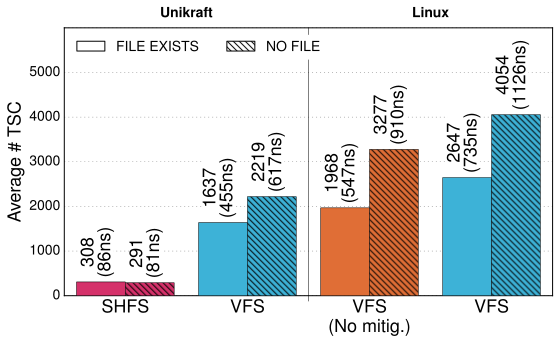               | Filesystem specialization and removal of the vfs layer yields important performance gains for a web cache when performing a look up and file open operation.                                                                  | 0h 5m        |

| Table                                               | Experiment                                                                                                                                                                                                                           | Est. runtime |
|-----------------------------------------------------|--------------------------------------------------------------------------------------------------------------------------------------------------------------------------------------------------------------------------------------|--------------|
| [`tab_01`](/experiments/tab_01_bincompat-syscalls/) | Cost of binary compatibility/syscalls with and without security mitigations.                                                                                                                                                         | 0h 25m       |
| [`tab_02`](/experiments/tab_02_abi/)                | Results from automated porting based on externally-built archives when linked against Unikraft using musl and newlib. We show whether the port succeeded with the glibc compatibility layer ("compat layer") and without it ("std"). | 2h 0m        |
| [`tab_04`](/experiments/tab_04_kvs_compare/)        | Performance of a specialized UDP-based in-memory key-value store on Unikraft vs. Linux.                                                                                                                                              |              |

| Text                                                  | Experiment                        | Est. runtime |
|-------------------------------------------------------|-----------------------------------|--------------|
| [`txt_01`](/experiments/txt_01_unikernel-boot-times/) | Unikernel boot time baseline.     | 0h 21m       |
| [`txt_02`](/experiments/txt_02_9pfs-boot-times/)      | Measures 9pfs boot time overhead. |              |

## 2. Repository structure

We have organised this repository as follows:

 * `experiments/` - All experiments are listed in this directory.  Each
   sub-directory is named with the figure number along with a short description
   of the experiment (e.g., `fig_01_linux-deps`).  In addition, each experiment
   sub-directory has a corresponding `README.md` which explains in more detail
   how the experiment works and how to run it.  Along with this, each
   sub-directory also comes with a `Makefile` with the following targets:
    - `prepare`: prepares the experiment, by usually downloading and building
      relevant images, tools, and auxiliary services necessary for running the
      experiment.
    - `run`: runs the experiment.
    - `plot`: produces the figure or table.  All plots are automatically saved
      into the [`plots/`](/plots) directory.
    - `clean`: removes intermediate build files.
       
 * `build/` - Intermediate build artifacts necessary for experiments to run.  
   This will be populated by the experiment's preparation (`prepare`) step.
 * `support/` - contains definitions of container images, `Dockerfile`s,
   which are used by multiple experiments.
 * `tools/` - contain programs which are used by multiple experiments.
 * `run.sh` - A tool that wraps all experiments and can be used to run them all
   or individually.  More details on this utility script are detailed below.

## 3. Prerequisites

### 3.1. Hardware

Before you can run these experiments, you will need to prepare 3 physical host
environments.  **Physical hosts as opposted to virtual machines are recommended
as they provide better performance.**  In the paper, we used three different
setups:

 1. A Linux host with KVM enabled and Linux kernel 4.19 (most
    experiments).  We use a somewhat older kernel because HermiTux will
    not run with newer versions, as noted [here](https://github.com/ssrg-vt/hermitux/issues/12).
 2. A Linux host with Linux kernel 4.19 used as a DPDK packet generator
    ([`fig_19`](/experiments/fig_19_compare-dpdk/)) which has an ethernet cable
    connected to the first host.  Additionally, we allowed for user-defined CPU
    frequency by setting `intel_pstate=disable` to produce [`tab_04`](/experiments/tab_04_kvs_compare/).
 3. A Xen host used for Xen 9pfs experiments ([`txt_02`](/experiments/txt_02_9pfs-boot-times/)).

A single server can be used for almost all experiments, though it would require
installing different Linux kernel versions, or the Xen hypervisor and rebooting
to switch from one set up to another.  The exception is the DPDK experiment,
which requires two servers connected to each other via a 10Gb link.

All of our results were run on inexpensive (roughly EUR 800)
[Shuttle SH370R6](http://global.shuttle.com/products/productsDetail?productId=2265)
boxes with an Intel i7 9700K 3.6 GHz (4.9 Ghz with Turbo Boost, 8 cores) and
32GB of RAM. For the DPDK experiment we used [Intel X520-T2](https://ark.intel.com/content/www/de/de/ark/products/69655/intel-ethernet-converged-network-adapter-x520-t2.html)
cards with the 82599EB chipset.


### 3.2. Kernel

All experiments were run on a physical host with Debian Buster and Linux 4.19
installed.  All install and preparation scripts in this repository target this
distribution and kernel version.

For all set ups, we disabled Hyper-Threading (`noht`) and isolated 4 CPU cores
(e.g. `isocpus=4,5,6,7`).  For reproducing [`tab_04`](/experiments/tab_04_kvs_compare/),
we allowed for user-defined CPU frequency (`intel_pstate=disable`).  This can be
done by setting kernel boot parameters, e.g. with pxelinux:

```
...
LABEL item_kernel0
  MENU LABEL Linux
  MENU DEFAULT
  KERNEL vmlinuz-4.19.0
  APPEND isolcpus=4,5,6,7 noht
  ...
```

From the remaining 4 CPU cores, we pinned one to the VM, another one to the VMM
(e.g., `qemu-system-x86_64`), and another one to the client tool (e.g., `wrk` or
`redis-benchmark`).  For all experiments, we set the governor to performance,
which can be done generally by:

```
echo "performance" > /sys/devices/system/cpu/cpu$CPU_ID/cpufreq/scaling_governor
```

However, both the pinning and governor settings are handled by the scripts in
this repo (as opposed to the kernel boot parameters, which you will need to take
care of manually).


## 4. Getting Started

1. Before running any of these experiments, prepare your host with the
   recommendations detailed above in [prerequisites](#3-prerequisites);

2. Many of the experiments use Docker as an intermediate tool for creating build
   and test environments (along with testing Docker itself).  Please
   [install Docker](https://docs.docker.com/get-docker/) on your system to
   continue;

3. Once Docker is installed, clone this repository
   ```bash
   git clone https://github.com/unikraft/eurosys21-artifacts.git
   ```

4. All experiments should be `prepare`d first, which installs necessary tools
   and downloads additional resources, before they can run.  This can be done by
   calling `run.sh fig_XX prepare` ([more details below](#41-runsh-usage)) for a
   single experiment or `run.sh prepare` for all experiments.  (Note: The
   preparation step for all experiments usually exceeds several hours.)

5. Once prepared, simply call the relevant experiment you wish to re-create
   using the `run.sh` script.


### 4.1. `run.sh` Usage

We have wrapped all the individual experiments with the `run.sh` tool.  This
script will install the necessary dependencies for all experiments (excluding
Docker) only for Debian Buster.  Please see [prerequisites](#3-prerequisites)
and [getting started](#4-getting-started) guide above.

```
./run.sh - Run all or a specific experiment.

Usage:
  ./run.sh [OPTIONS] [FIGURE_ID|TEST_NAME] [ACTION]

If no figure ID or test name is provided, the action is run for all
experiments.  If no action is provided, all actions are performed.

Examples:
  ./run.sh fig_01      Runs prepare, run and plot for fig_01.
  ./run.sh prepare     Prepares all experiments.

Actions:
  prepare              Prepares the host and/or builds dependent tools
                         and images before the test is run.
  run                  Runs the given experiment and saves the results.
  plot                 Uses the data from the experiment to generate
                         the plot.
  clean                Clean intermediate build files from an experiment.

Options:
     --no-deps         Do not try to install dependencies.
     --no-docker-plot  Do not use Docker for plotting.
  -l --list            List all tests and exit.
  -v --verbose         Be verbose.
  -h --help            Show this help menu.

Influential Environmental Variables
  EXPERIMENTS_DIR      Directory of all the experiments
                         (default: ./experiments).
  DOCKER_FORCE_BUILD   Force build of Docker containers
                         (default: y).
  DOCKER_IMAGE_PLOT    Docker environment for generating plots
                         (default: unikraft/eurosys21-artifacts-plot:latest).
  PLOT_FORMAT          File format for the plot
                         (default: svg).
```

Each experiment, and more specifically its sub-directory in `experiments/`, is
populated with a `README.md` which includes more detail about the individual experiment.

## 5. Notes

* We use intermediate Docker containers for building images and accessing
  pre-built binaries for many of the experiments.  In addition to this, this 
  repository clones the Linux kernel to make changes for testing.  As a result,
  expected disk storage utilized to conduct all experiments is ~50GB.

* The preparation step for all experiments usually exceeds several hours.

* Experiments cannot be run in parallel due to overlapping CPU core affinities,
  which will affect measurements.

## 6. Beyond the Paper

This repository only contains the performance evaluation of Unikraft.
In addition to this README, the Unikraft project provides [extensive
documentation](http://docs.unikraft.org/) on how to use Unikraft in
real-world environments. In addition, interested researchers are
welcome to join the community via the Xen project [mailing
list](https://lists.xenproject.org/cgi-bin/mailman/listinfo/minios-devel)
and [GitHub](https://github.com/unikraft).
