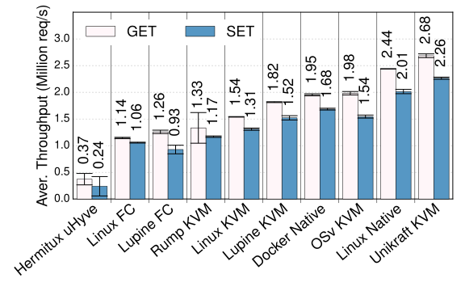

# Redis throughput comparison

We measure the throughput of [Redis](https://redis.io/) in a wide range of
systems, including:

 * [HermiTux](https://ssrg-vt.github.io/hermitux/) on [uHyve](https://github.com/hermitcore/uhyve);
 * [Lupine](https://github.com/hckuo/Lupine-Linux) on [Firecracker](https://firecracker-microvm.github.io/);
 * Lupine on KVM;
 * Linux on Firecracker;
 * Linux on KVM;
 * Linux as a userspace binary;
 * [OSv](https://github.com/cloudius-systems/osv) on KVM;
 * [Rumprun](https://github.com/rumpkernel/rumprun) on KVM;
 * Docker; and,
 * Unikraft on KVM.

We vary the request type using
[`redis-benchmark`](https://github.com/redis/redis/blob/2.2/src/redis-benchmark.c),
using 30 concurrent connections, 100k requests, and a pipelining level of 16.
From the paper, "we did not optimize application or kernel configurations for
performance, however we took care of removing obvious performance bottlenecks
for each system, _e.g._, switching on memory pools in Unikraft's networking
stack (based on [lwIP](https://github.com/unikraft/lib-lwip)), or porting Lupine
to QEMU/KVM in order to avoid Firecracker performance bottlenecks."

## Usage

 * `./genimages.sh` downloads and builds the tested images and takes about 3m
   on average;
 * `./benchmark.sh` runs the experiment and takes about 6m on average; and
 * `./plot.py` is used to generate the figure.
