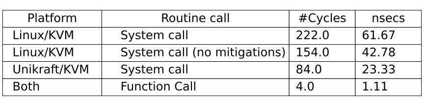

# System Call Performance



The experiments in this folder will evaluate the costs of a `noop`
system call and a function call on a Linux KVM VM and Unikraft KVM
VM. The same benchmark ELF binary (sources under `src/`) is executed
on both kernels. Because we want to measure a baseline: the time
needed to enter and exit a system call handler, the kernels are
instrumented with a `noop` system call (number 500) that only
returns a constant value. Under the folder `linux/` you can find
the binary and build configuration of a patched vanilla Linux 5.11.0
kernel. You find also build instructions there.

Please note that these experiments do their measurement with the TSC.
You need to make sure that your machine does _not_ dynamically scale
the CPU frequency while the experiment is running. This makes sure
that the TSC clock can be considered stable.
On recent Intel CPUs you can achieve pinning the CPU frequency by
adding `intel_pstate=disable` to the Linux kernel arguments of
the host (on Debian see `/etc/default/grub`). After a reboot, our
script `/tools/tunecpumax` can help you enabling the `userspace`
frequency scaling governor on your host and setting up the maximum
non-turbo frequency permanently to your CPU.

## Usage

1. `./clone-deps.sh` - Clones needed repositories from GitHub to
   build a Unikraft unikernel that can execute the benchmark ELF
   binary
2. `./build-elfloader.sh` - Compile the Unikraft unikernel for this
   experiment
3. `./build-benchmark.sh` - Builds the benchmark binary within `src/`
4. `./build-fses.sh` - Creates an initramdisk that only contains the
   benchmark program as init process for the Linux experiments.
5. `./run.sh` - Run the experiments, console outputs are stored
   under `eval/parsed/` for later evaluation.
6. `./parse.sh` - Parses the console outputs, intermediate data within
   `eval/`
7. `./process.sh` - Computes the average, median, q1, and q3 over the
   data. It creates a table within `results/`

Alternatively, you can execute these steps with `make all`.
All steps together take roughly 25 mins.

With `./clean.sh` you can delete all compilation units, cloned
repositories and intermediate measurement data. It keeps the final
overview table of the experiment within `results/`.

## Expected kernel panics

While the experiments are running, you may notice kernel panics for
the Linux experiments:

``` text
[    1.317775] Kernel panic - not syncing: Attempted to kill init! exitcode=0x00000000
[...]
```

This particular panic message (`Attempted to kill init!`) is expected.
It happens because we do execute our benchmark program as system
initialization process instead of `/sbin/init`. When our benchmark
completed, the process exits and returns `0`. As long as the
`exitcode` is 0 (`0x00000000`), our experiment executed successfully.
